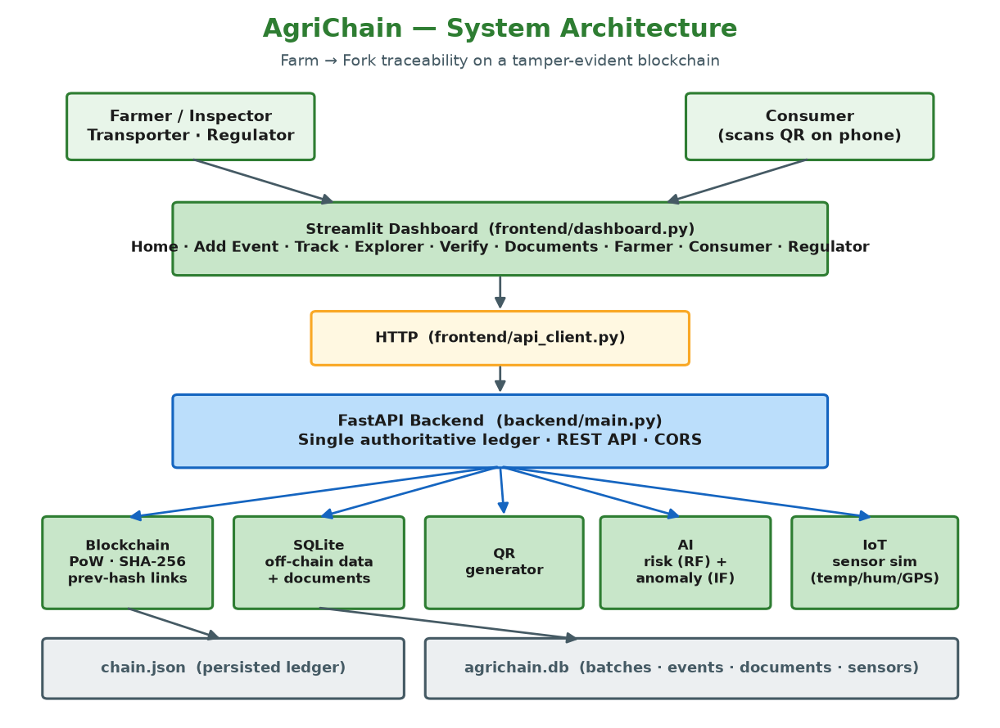
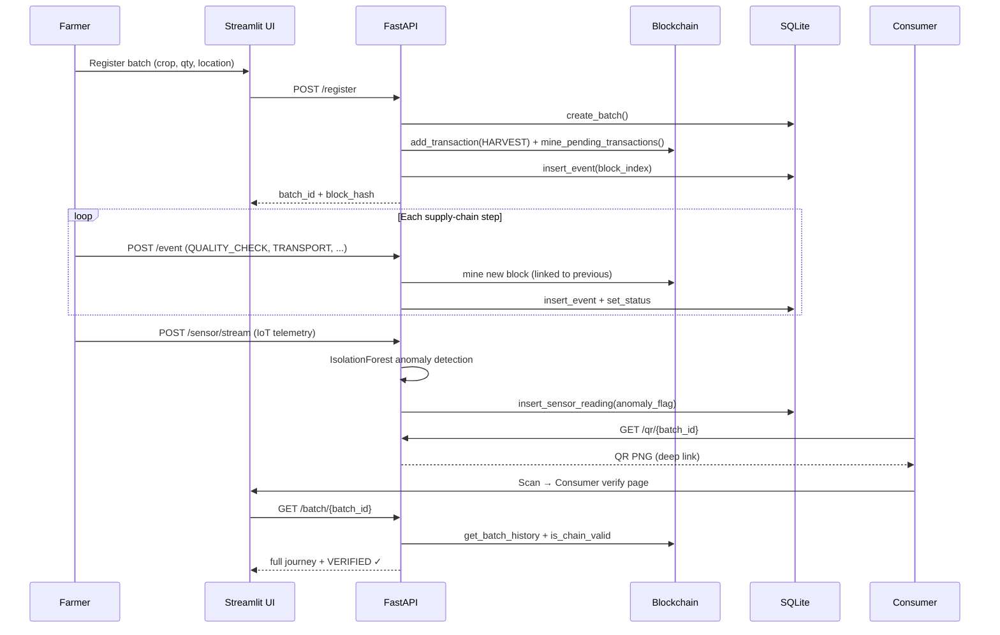

# AgriChain — How It Works (End to End)

This document explains the complete AgriChain system: the design philosophy, the
blockchain internals, the on-chain / off-chain split, the full batch lifecycle,
and how QR verification, IoT anomaly detection, AI risk scoring and document
hashing fit together.



---

## 1. Design philosophy

**One authoritative ledger.** The blockchain lives *only* inside the FastAPI
backend process (`backend/ledger.py`) and is persisted to `chain.json`. The
Streamlit UI, the seed script and the demo scripts **never build their own
chain** — they talk to the backend over HTTP (`frontend/api_client.py`). This
guarantees a single source of truth and mirrors how a real node/API would work.

**On-chain vs off-chain.** Blockchains are bad at storing bulk data. AgriChain
therefore stores only a **compact event record plus a `data_hash`** on-chain,
and keeps the full payloads, uploaded documents and raw sensor streams in
**SQLite** (`agrichain.db`). The `data_hash` cryptographically binds the
off-chain data to the on-chain record.

```
              ON-CHAIN (chain.json)                 OFF-CHAIN (agrichain.db)
   ┌──────────────────────────────────┐    ┌───────────────────────────────────┐
   │ batch_id, event_type, actor_id,   │    │ batches, events (full JSON),      │
   │ location, timestamp, data_hash    │◄──►│ documents (files+hash), sensors   │
   │ + block: index, prev_hash, nonce, │    │                                   │
   │   hash (proof-of-work)            │    │                                   │
   └──────────────────────────────────┘    └───────────────────────────────────┘
```

## 2. The Batch ID

Every product batch gets a deterministic, human-readable ID:

```
{CROP[:4].upper()}-{LOCATION[:6].upper()}-{YEAR}-{SEQ:04d}
    e.g.  Rice + Konaseema + 2026 + 1st  ->  RICE-KONASE-2026-0001
```

The sequence number comes from `Database.next_sequence()`, which counts existing
batches with the same prefix — so IDs are unique and ordered per crop/location/year.

## 3. Block structure

Defined in `backend/blockchain.py`. Each `Block` holds:

| Field | Meaning |
|-------|---------|
| `index` | Position in the chain (genesis = 0) |
| `timestamp` | Unix time when mined |
| `transactions` | List of event records packed into this block |
| `previous_hash` | Hash of the preceding block (the "link") |
| `nonce` | Proof-of-work counter |
| `hash` | The mined SHA-256 digest of the block's content |

### Hashing

```python
hash = SHA-256( json.dumps({
    "index": index,
    "timestamp": timestamp,
    "transactions": transactions,
    "previous_hash": previous_hash,
    "nonce": nonce,
}, sort_keys=True, default=str) )
```

Two crucial details:

1. The stored `hash` field is **excluded** from its own digest (otherwise it
   couldn't be computed).
2. Serialization is **canonical** (`sort_keys=True`), so the hash is
   deterministic regardless of dict key order.

## 4. Proof-of-Work mining

`Block.mine_block(difficulty)` increments `nonce` and recomputes the hash until
it starts with `difficulty` leading zeros:

```
difficulty = 3  →  hash must look like  000a1b2c...
```

This is a genuine (if lightweight) proof-of-work: finding such a nonce takes
work, so re-mining a tampered block is not free. `config.DIFFICULTY = 3` for the
live demo; `TEST_DIFFICULTY = 2` keeps the test suite and bulk seeding fast.

## 5. Linking & validation

Every new block stores the previous block's hash. `Blockchain.is_chain_valid()`
walks the chain and checks two things per block:

1. **Content integrity** — does `block.hash` still equal
   `block.compute_hash()`? (i.e. have the transactions been edited since mining?)
2. **Linkage** — does `block.previous_hash` equal the actual hash of the
   previous block?

It also verifies the genesis block's hash and its fixed `previous_hash = "0"`.

## 6. Tamper detection (the "money shot")

Because a block's hash is derived from its contents, **editing a stored
transaction without re-mining** makes `compute_hash()` diverge from the stored
`hash`, and validation fails immediately.

```
Register a batch (quantity_kg = 2500)   →  chain_valid = True
POST /debug/tamper  (quantity_kg → 9999999, NOT re-mined)
GET  /verify                            →  chain_valid = False  ⚠ INTEGRITY COMPROMISED
POST /debug/reset                       →  chain_valid = True
```

The offline `scripts/tamper_demo.py` reproduces this without a server — see
[`TEST_RESULTS.md`](TEST_RESULTS.md) for the captured output.

## 7. Persistence

`Blockchain.save(path)` serialises the whole chain (difficulty + blocks +
pending) to JSON; `Blockchain.load(path)` restores it, bypassing `__init__` so
it does not recreate a genesis block. The backend persists after every
state-changing endpoint (`backend/ledger.py::persist`).

## 8. Off-chain database schema

SQLite (`agrichain.db`, WAL mode). Four tables (`backend/database.py`):

**`batches`** — one row per registered product
`batch_id (PK), crop, farmer, location, quantity_kg, quality_grade, status, created_at`

**`events`** — full event payloads mirrored off-chain
`id, batch_id, event_type, actor_id, location, timestamp, data_json, data_hash, block_index`

**`documents`** — uploaded certificates
`id, batch_id, filename, filepath, sha256, uploaded_at`

**`sensor_readings`** — IoT telemetry
`id, batch_id, temperature, humidity, gps_lat, gps_lon, timestamp, anomaly_flag`

## 9. End-to-end batch lifecycle



### Event types

`HARVEST` → `QUALITY_CHECK` → `TRANSPORT` → `WAREHOUSE_ENTRY` → `PROCESSING` →
`DISTRIBUTION` → `RETAIL`, plus `DOCUMENT` (records a certificate hash). Each
event becomes its own mined block; the batch `status` advances to the latest
event type.

## 10. QR verification flow

`qr/qr_generator.py` encodes a **deep link** to the Streamlit consumer page
(port 8501), not the raw JSON API:

```
http://127.0.0.1:8501/?page=Verify&batch_id=RICE-KONASE-2026-0001
```

Scanning opens the human-friendly verify screen, which calls
`GET /batch/{batch_id}` and shows Origin / Quality / Supply-chain / Blockchain
verification checkmarks. Unknown batches are reported as possible counterfeits.

## 11. IoT anomaly detection

`iot/sensor_sim.py` generates realistic cold-chain telemetry: temperature
~N(25, 1.5) °C, humidity ~N(65, 5) %, GPS around the Godavari delta. Injecting
an anomaly forces the final reading to a ~89 °C spike (a broken reefer unit).

`ai/anomaly.py` flags anomalies with an **IsolationForest** over
(temperature, humidity). The backend uses the persisted model
(`anomaly_model.joblib`) when present, otherwise fits ad-hoc; with fewer than 6
readings it falls back to a physical threshold (t > 35 or t < 15 °C).

## 12. AI risk scoring

`ai/risk.py` offers two complementary views:

- **Rule-based** (`calculate_risk`) — transparent 0–100 score:
  temp > 35 (+30), humidity > 80 (+20), delay > 24 h (+25), quality < 70 (+25);
  `HIGH` (>60) / `MEDIUM` (≥30) / `LOW`.
- **RandomForest** trained on the synthetic dataset, exposing feature importance
  for explainability. The `/risk` endpoint returns both the rule score and the
  ML prediction (`AT_RISK` / `OK`).

## 13. Document verification

On the **Documents** page (or `POST /document`):

1. The file is saved off-chain under `data/uploads/`.
2. Its SHA-256 is computed (`calculate_file_hash`) and written **on-chain** as a
   `DOCUMENT` transaction, and to the `documents` table.
3. `POST /document/verify` re-hashes an uploaded file and compares it to the
   on-chain hash → **MATCH** (authentic) or **MODIFIED** (forged/altered).

This extends tamper-evidence from structured events to arbitrary files
(certificates, lab reports, invoices).

## 14. Where everything lives

| Concern | File |
|---------|------|
| Config (paths, ports, difficulty, seeds) | `config.py` |
| Blockchain engine | `backend/blockchain.py` |
| Off-chain DB | `backend/database.py` |
| Ledger singletons | `backend/ledger.py` |
| API + endpoints | `backend/main.py` |
| Pydantic models / enums | `backend/models.py` |
| Dashboard (9 pages) | `frontend/dashboard.py` |
| HTTP client | `frontend/api_client.py` |
| Risk / anomaly AI | `ai/risk.py`, `ai/anomaly.py` |
| IoT simulation | `iot/sensor_sim.py` |
| QR generation | `qr/qr_generator.py` |
| Dataset generator | `data/generate_dataset.py` |
| Scripts | `scripts/{seed_demo,tamper_demo,train_models,make_architecture,make_submission}.py` |
